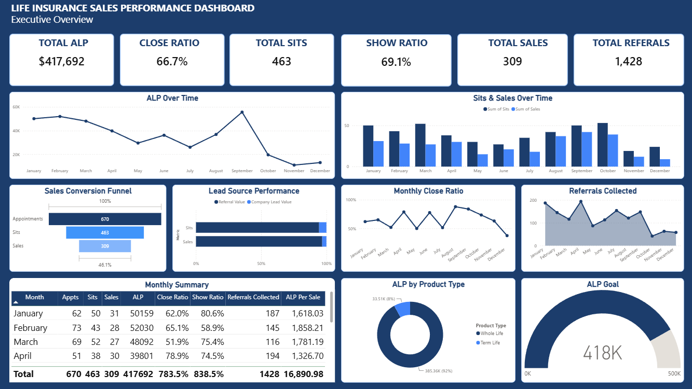
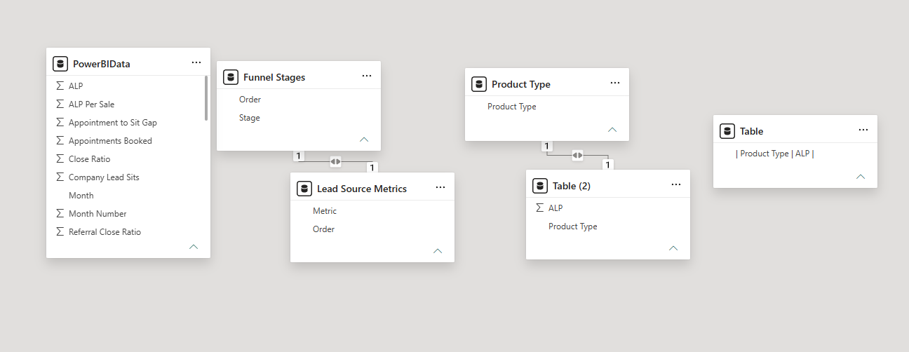

# Life Insurance Sales Performance Dashboard

An executive Power BI dashboard built using a simulated life insurance sales dataset. This project demonstrates an end-to-end business intelligence workflow, including data transformation with Power Query, relational data modeling, DAX measure development, and executive-focused dashboard design.

---

## Dashboard Preview

---

## Project Overview

This interactive Power BI dashboard provides an executive-level view of life insurance sales performance. It enables leadership to monitor key performance indicators (KPIs), evaluate sales trends, analyze conversion metrics, and identify opportunities to improve business performance.

The report demonstrates how business intelligence can transform sales data into actionable insights that support data-driven decision-making.

---

## Data Model

The dashboard is built using a relational data model with supporting lookup tables for funnel stages, lead source metrics, and product types. This structure enables reusable DAX measures, consistent filtering, and scalable dashboard reporting.

---

## Dashboard Features

### Executive KPIs
- Total Annualized Premium (ALP)
- Total Sales
- Total Sits
- Appointments Booked
- Close Ratio
- Show Ratio
- Total Referrals Collected

### Sales Analytics
- Monthly ALP Trend
- Sales vs. Sits Comparison
- Monthly Close Ratio
- Referral Performance

### Pipeline Analytics
- Sales Conversion Funnel
- Lead Source Performance

### Product Analytics
- Product Mix Analysis

### Performance Monitoring
- ALP Goal Tracking
- Monthly Summary Table

---

## Business Questions Answered

This dashboard helps answer questions such as:

- How is annualized premium trending over time?
- How effectively are appointments converting into sales?
- Which lead sources generate the highest production?
- Which insurance products contribute the most premium?
- How are referrals impacting overall sales performance?
- Which months experienced the strongest and weakest production?

---

## Skills Demonstrated

- Power BI Dashboard Development
- Relational Data Modeling
- Power Query
- DAX Measure Development
- KPI Design
- Interactive Reporting
- Data Visualization
- Executive Reporting
- Business Intelligence

---

## Tech Stack

| Tool | Purpose |
|------|---------|
| Power BI Desktop | Dashboard Development |
| DAX | KPI Calculations & Business Logic |
| Power Query | Data Cleaning & Transformation |
| Microsoft Excel | Source Dataset |
| GitHub | Portfolio Hosting |

---

## What I Learned

This project gave me hands-on experience building a complete business intelligence solution from raw data to executive reporting. Throughout the development process, I strengthened my ability to:

- Design executive dashboards focused on business performance
- Build reusable DAX measures for KPI reporting
- Transform and prepare data using Power Query
- Create relational data models to support interactive reporting
- Develop dashboards that communicate business insights through clear visualizations
- Apply dashboard design principles to improve readability and executive decision-making

---

## Key Insights

- Annualized Premium (ALP) totaled **$417,692** during the reporting period.
- The overall **Close Ratio** was **66.7%**.
- The overall **Show Ratio** was **69.1%**.
- Premium production peaked in **September**, while production declined during the final quarter.
- Referral and lead source analysis highlights the most effective customer acquisition channels.

---

## Dataset

This project uses a **simulated life insurance sales dataset** created for portfolio and educational purposes.

---

## Project Goals

This project was created to strengthen my Power BI and business intelligence skills by designing an executive sales dashboard that demonstrates data modeling, DAX development, interactive reporting, and effective business storytelling using a simulated life insurance sales dataset.

---

## Author

**Jasmyne Norris**

Power BI • Business Intelligence • Data Analytics
